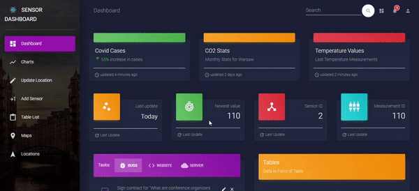
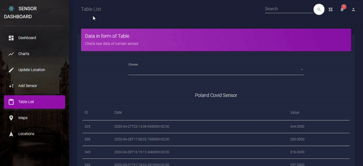
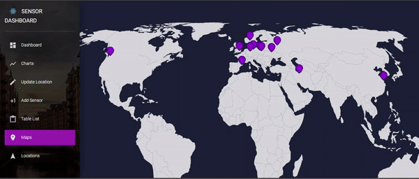
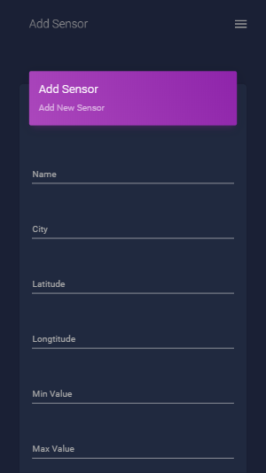
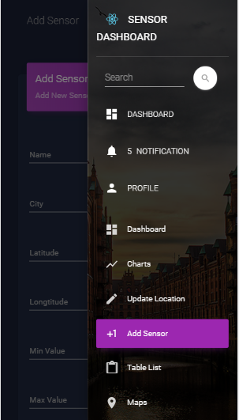

# SensorDashboard
App that allows to gather and visualise data from sensors.
Sensors can be freely added, modified and it's location can be
tracked in real time (charts also can be viewed in real time).
It was meant to work with ESP8266 but can be integrated with any
device which is capable of doing HTTP requests.
Some tables are currently populated with COVID-19 data in order to test functionality.

# Keep in mind that this is only prototype and some bugs can occour

# Live demo is available at https://sensor-dashboards.herokuapp.com/
Thanks to Heroku and AWS RDS it was possible to deploy this app. 

#  App basic functionality

|Dashboard|
|---|
||

|Plot Charts|
|---|
||

|Data in table form|
|---|
||

|Sensors location|
|---|
||
    
#  It's also responsive

|Adding sensor|Navbar|
|---|---|
|||
