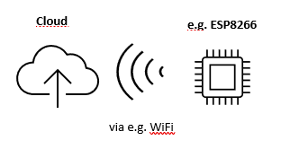
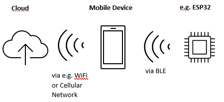
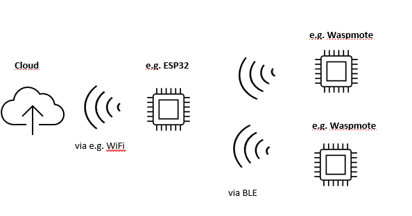
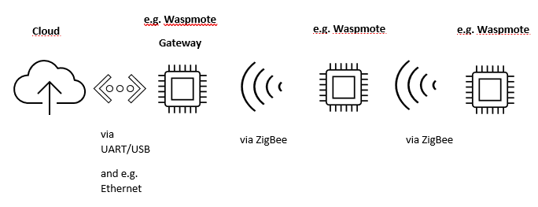
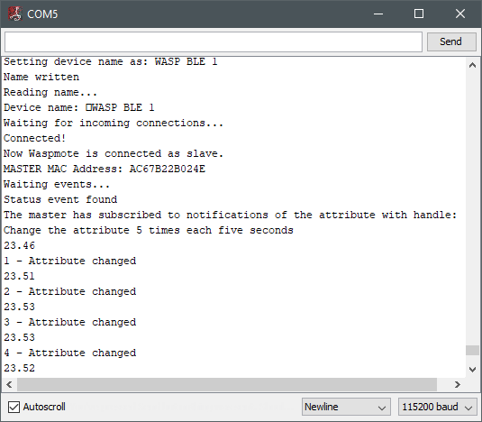
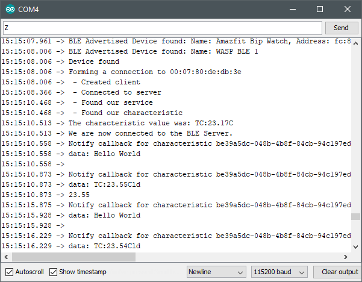

## Sensors

There are two types of bluetooth devices. Server is created based on Waspmote platform. On the other hand Client is created based on ESP32. 

Operation below is based on premise that we have router (server) and coordinator (client)(both of them have BLE modules). Router is responsible for gathering data and sending it to the coordinator. Coordinator collects data from router (or routers if we have more of them) and can for example send data to the cloud with use of HTTP Requests (Internet Connection is made through WiFi). 

Coordinator can serve as a data gatherer too. For example we have ESP8266 and it can connect to the Internet and gather data. 

# Possible Scenarios of communication of sensors with cloud

Sensor that is sending data directly: 

||

Sensor that is sending data with use of a phone: 
||

Sensor that is sending data with use of a BLE gateway: 
||

Sensor that is sending data with use of a ZigBee gateway: 
||

|Server which is gathering data|
|---|
||
    
|Client which is getting data from Server|
|---|
||
    